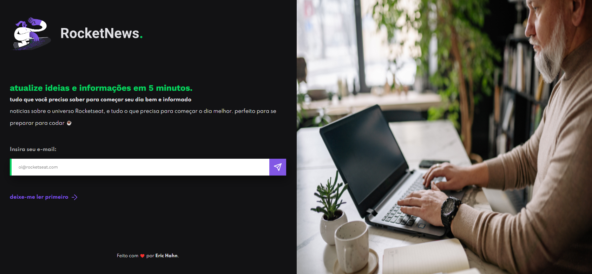

# 📰 RocketNews - Captura de E-mails (RocketNews - Email Capture)

🗯️ Esse projeto foi proposto como desafio no treinamento Discover da Rocketseat. Uma página Newsletter para capturar e-mails. A página foi feita com referência de um projeto do Figma, de maneira onde o desafio seria transformar o design em um projeto real front-end.

(This project was proposed as a challenge in the Rocketseat Discover training. A Newsletter page to capture emails. The page was made with reference to a Figma project, so the challenge would be to transform the design into a real front-end project.)

Obs: O e-mail cadastrado na página será de forma fictícia e não será colocado em nenhum banco de dados!

Note: The email registered on the page will be fictitious and will not be placed in any database!

# 🌟 Demonstração (Demonstration)

  

[Visualizar Website - View Website](https://erich4hn.github.io/rocketnews-capture/)

# 📝 Requisitos (Requirements)

- Navegador (Browser)

# 🎲 Tecnologias Utilizadas (Technologies Used)

- HTML5
- CSS3
- Javascript

# 💡 Autor (Author)

<a href="https://github.com/erich4hn">Eric Hahn 👔</a>

